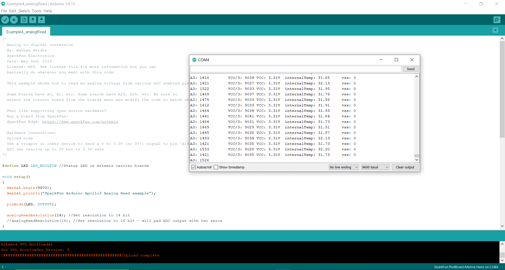

# Lab 1: Setup
The goal of this lab was to gain familiarity with the Artemis board as well as set up our VM for the class. This write up will focus on the artemis board.
## First Steps
In order to begin programming the board, I needed to install the Arduino development environment and add in the Sparkfun Apollo3 board support pack. With integrated, I was ready to connect the Artemis Nano and run some code.
## LED Blink
The first example I ran was the Blink example provided by Arduino. This code toggles the onboard LED once per second. The Artemis Nano has multiple status LEDs, but the only one that can be user controlled is the Blue LED, so that is what is toggled here.

<iframe width="560" height="315" src="https://www.youtube.com/embed/tHG4yXJTqCA" frameborder="0" allow="accelerometer; autoplay; encrypted-media; gyroscope; picture-in-picture" allowfullscreen></iframe>

## Serial Communication
The next important test was serial communication with the Artemis Nano. This was done using the 'Example2_Serial' code provided by Sparkfun. After uploading this code to the board, I was able to open the Serial Monitor and communicate with the board successfully, as shown below. 

<iframe width="560" height="315" src="https://www.youtube.com/embed/p75CnPiYeoA" frameborder="0" allow="accelerometer; autoplay; encrypted-media; gyroscope; picture-in-picture" allowfullscreen></iframe>

## Analog Read
Next, I tested the Example4_analogRead code, also provided by Sparkfun. This code returns the temperature of the board. By holding the board and breathing hot air onto it, I could observe the temperature value change in the Serial Monitor. This image shows the base temperature of the board:

And this is the temperature after holding the board for a minute or so:

This confirmed that I could succesfully read analog data from the board.

## Microphone Read
Next up was the Example1_MicrophoneOutput example. Using the Serial Monitor, this example would display the highest frequency that the board detected. It was mostly noise, but when I whistled at a fairly constant frequency, I could see my whistle register in the Serial Monitor. This is shown in the video where the frequency sits somehwere between 1100Hz and 1200Hz.  

<iframe width="560" height="315" src="https://www.youtube.com/embed/YxmaB9ZdKSA" frameborder="0" allow="accelerometer; autoplay; encrypted-media; gyroscope; picture-in-picture" allowfullscreen></iframe>

## Whistle Control
Lastly, I combined the Blink and Example1_MicrophoneOutput examples to control the blue LED with my whistling. In addition, a seperate battery was used (the yellow LED indicates the battery is charging) so that the board can be used without needing connection to a computer at all times. Starting with the microphone code, I added to the setup loop:

'''
pinMode(LED_BUILTIN, OUTPUT);
'''

To initialize the LED. The '<LED_BUILTIN>' macro is recognized by Arduino for the Artemis Nano. To change the LED, I went to the section of the code where the freuqency is found and added the following conditions:

'''
'Serial.printf("Loudest frequency: %d         \n", ui32LoudestFrequency);
  if ( ui32LoudestFrequency < 1300 && ui32LoudestFrequency > 1000 ) digitalWrite(LED_BUILTIN, HIGH);
  else digitalWrite(LED_BUILTIN, LOW);'
'''

This code lights the LED for frequencies between 1000Hz and 1300Hz. This range was chosen since my whistle was around 1100Hz. After uploading this code, I observed it working both when the board was connected to the computer, and when it was just connected to the battery.

<iframe width="560" height="315" src="https://www.youtube.com/embed/qE5PdKLxpS0" frameborder="0" allow="accelerometer; autoplay; encrypted-media; gyroscope; picture-in-picture" allowfullscreen></iframe>
