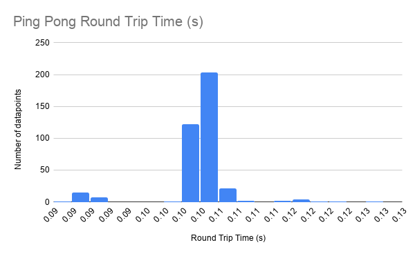

# Lab 2: Bluetooth Communication
The goal of this lab was to establish communication between my machine and the Artemis Nano. This was done using a small Bluetooth LE adapter, and provided Arduino and Python code to establish the communication channel.

## Setup and Initial Connection
To begin this lab, I connected the Bluetooth adapter to my machine. With a little bit of setup and a computer restart, the adapter was ready to go. Next, I installed **bleak** with the command: 
```
python -m pip install bleak
```
With bleak installed, I was now ready to work with the distribution code. <br/>

After uploading the Arduino sketch to the Artemis board, I ran `main.py` in order to discover the board. I was able to discover the board, but could not connect with it until I added the MAC address to `settings.py` in the `cached` field. After this update, I could connect to the Artemis board, but it would often require many attempts to do so. 

## Pinging the Robot
To ping the robot, I edited the `myRobotTasks()` function in `main.py`. To send simple "ping pong" messages back and forth, I commented out `pass` and uncommented the line:
```
await theRobot.ping()
```
With this line, the Artemis and my computer would now "ping pong" each other after running `main.py` once more. Here is what that looked like on both ends:


The Powershell window shows the received 'pong' messages from the Artemis and the round trip time of each message. The Arduino serial monitor window also shows the succesful communication between the two systems. The message size shown is the size of a 'ping' message from the Artemis board to the computer in bytes. Each ping is 99 bytes. After recording the Round Trip Time (RTT) of 380 ping pong messages, I saw that the typical RTT was around 105ms. This is a fairly large RTT, especially when compared to the integer message RTTs later in this lab. The Histogram below shows the RTTs of the 380 recorded datapoints. The times ranged from 85ms-127ms with an average time of 104.12ms. 

