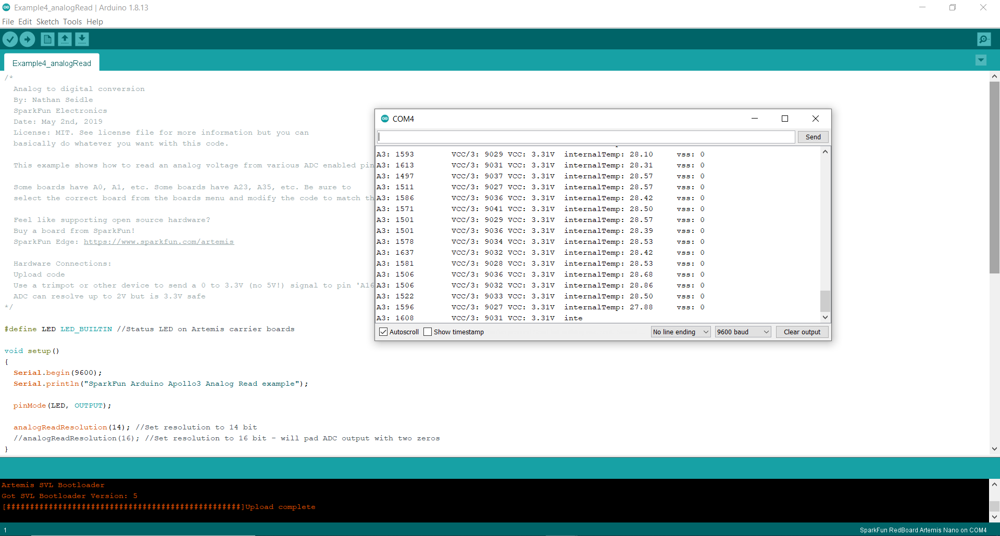
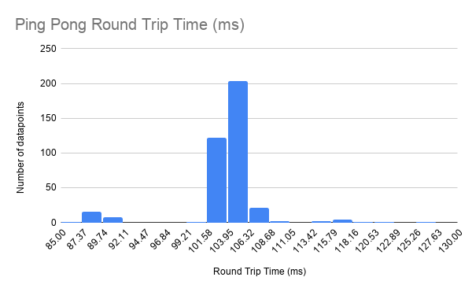

# Lab 2: Bluetooth Communication
The goal of this lab was to establish communication between my machine and the Artemis Nano. This was done using a small Bluetooth LE adapter, and provided Arduino and Python code to establish the communication channel.

## Setup and Initial Connection
To begin this lab, I connected the Bluetooth adapter to my machine. With a little bit of setup and a computer restart, the adapter was ready to go. Next, I installed **bleak** with the command: 
```
python -m pip install bleak
```
With bleak installed, I was now ready to work with the distribution code. <br/>

After uploading the Arduino sketch to the Artemis board, I ran `main.py` in order to discover the board. I was able to discover the board, but could not connect with it until I added the MAC address to `settings.py` in the `cached` field. After this update, I could connect to the Artemis board, but it would often require many attempts to do so. 

## Pinging the Robot
To ping the robot, I edited the `myRobotTasks()` function in `main.py`. To send simple "ping pong" messages back and forth, I commented out `pass` and uncommented the line:
```
await theRobot.ping()
```
With this line, the Artemis and my computer would now "ping pong" each other after running `main.py` once more. Here is what that looked like on both ends:



The Powershell window shows the received 'pong' messages from the Artemis and the round trip time of each message. The Arduino serial monitor window also shows the succesful communication between the two systems. The message size shown is the size of a 'ping' message from the Artemis board to the computer in bytes. Each ping is 99 bytes. After recording the Round Trip Time (RTT) of 380 ping pong messages, I saw that the typical RTT was around 105ms. This is a fairly large RTT, especially when compared to the integer message RTTs later in this lab. The Histogram below shows the RTTs of the 380 recorded datapoints. The times ranged from 85ms-127ms with an average time of 104.12ms. 



Using the average time of 104.12ms RTT and a payload size of 99 bytes (in each direction), we can calculate a transmission rate of 15213 bits/second. This is significantly slower than the serial connection between the Artemis and the serial monitor, which is 115200 bits/second. 

## Requesting a Float
This part of the lab was about constructing a message to send from the Artemis to the computer. In this case, the message sent a float value (I used 3.14). Once again, `main.py` needed to be edited in order to wait for the proper command. This time, the line used was:
```
await theRobot.sendCommand(Commands.REQ_FLOAT)
```
In the Arduino code, changes were made to the `case REQ_FLOAT:` case in the main loop.  The code added was as follows:
```
case REQ_FLOAT:
    Serial.println("Going to send a float");
    ((float *)res_cmd->data)[0] = 3.14;
    res_cmd->command_type = GIVE_FLOAT;
    float_mes_size = sizeof(float) + sizeof(cmd_type_e) + sizeof(uint8_t);
    Serial.printf("message size is %d \n", float_mes_size);
    amdtpsSendData((uint8_t *)res_cmd, float_mes_size);
    break;
```
This code stores the float value 3.14 inside of `res_cmd->data`. That field is, by default, a uint8_t and so it must be cast to a float in order to hold a float value. After storing the data, the command type is updated. `GIVE_FLOAT` is used here as that is the Artemis bluetooth command used to send a float to the computer. Finally, the message size is calculated. The message contains a float (float), a command type (cmd_type_e), and the length of the data (uint8_t). The `sizeof` function is used to get the size of each of these data types in bytes. This total size is used in the `amdtpsSendData()` function along with the message being sent. 
<br/>
Here is what the float looked like when it was received by the computer:
 
 
 
 This value looks a bit different from the simple 3.14 that was sent from the Artemis. This inconsistency shows that is unreliable to compare float values across the two systems. 
 
 ## Testing the Data Rate
 This section of the lab involved sending data of varying size in a byte stream from the Artemis to the computer. Doing this gave me a better understanding of the reliablity of the bluetooth connection as well as the data transfer rate. To start, the Python code needed to now look for the `BYTESTREAM_TX` command. This was done using the following line of code:
 ```
 await theRobot.testByteStream(25)
 ```
 The Python code also needed to be modified in order to unpack the received data. In my testing, I sent two different packets. One packet consisted of a 32 bit integer followed by a 64 bit integer. This was unpacked using `unpack("<Iq", data)` where 'I' represents an integer (4 bytes) and 'q' represents a long long (8 bytes). These sizes correspond to the 32 bit integer and 64 bit integer respectively. My larger packet consisted of alternating 32 bit and 64 bit integers 7 times. As such, it needed to be unpacked using `unpack("<IqIqIqIqIqIqIq", data)`. With these changes, the computer was ready to receive data from the Artemis. Now, I needed to modify the Arduino code.
 <br/>
 In the Arduino code, I set `bytestream_active` to 1 in the `START_BYTESREAM_TX` case. The rest of my code changes were in the `if (bytestream_active)` section of the main loop. The following code was used to send the small data packet:
 
 ```
 res_cmd->command_type = BYTESTREAM_TX;

 // send one 32bit int and one 64 bit int (14 byte packet size)       
 res_cmd->length = 14;
 // 32 bit integer
 uint32_t send32 = 12345;
 // 64 bit integer
 uint64_t send64 = 123456789;
 // copy to data
 memcpy(res_cmd->data, &send32, 4);
 memcpy(res_cmd->data+4, &send64, 8);
 // send message
 amdtpsSendData((uint8_t *)res_cmd, 14);
 // check time 
 unsigned long data_time = micros();
 Serial.printf("Msg %d sent, %d microseconds \n", numMsg, data_time);
 numMsg++;
 // stop after 500 messages for data collection
 if (numMsg == 500) bytestream_active = 0;
 ```
 
 Here, `memcpy()` was used to load data as that was suggested on Campuswire. Also, 14 bytes are sent because it is 12 for the data, 1 for the command type, and 1 for the data length. The `micros()` function is used to get the current time, which is compared against the next time through the loop. Finally, `numMsg` is used to only send 500 packets. I wanted an exact number so I could compare that number against the number of packets received to check reliablity.
 <br/>
 For the small data size, the average time between transmissions was 11 ms, with times ranging from 10.5 ms to 13.28 ms. Of the 500 sent packets, 398 were received, giving a percent loss of 20.4%. The histogram below shows the transmission times of the 500 messages:
 
 
 
 
 <br/>
 To send larger packets (86 bytes), this code was used:
 
 ```
 // send multiple 32 bit and 64 bit integers (86 byte packet size)      
 res_cmd->length = 86;
 // 32 bit integer
 uint32_t send32 = 12345;
 // 64 bit integer
 uint64_t send64 = 123456789;
 // copy to data
 memcpy(res_cmd->data, &send32, 4);
 memcpy(res_cmd->data+4, &send64, 8);
 memcpy(res_cmd->data+12, &send32, 4);
 memcpy(res_cmd->data+16, &send64, 8);
 memcpy(res_cmd->data+24, &send32, 4);
 memcpy(res_cmd->data+28, &send64, 8);
 memcpy(res_cmd->data+36, &send32, 4);
 memcpy(res_cmd->data+40, &send64, 8);
 memcpy(res_cmd->data+48, &send32, 4);
 memcpy(res_cmd->data+52, &send64, 8);
 memcpy(res_cmd->data+60, &send32, 4);
 memcpy(res_cmd->data+64, &send64, 8);
 memcpy(res_cmd->data+72, &send32, 4);
 memcpy(res_cmd->data+76, &send64, 8);
 // send message
 amdtpsSendData((uint8_t *)res_cmd, 86);
 // check time 
 unsigned long data_time = micros();
 Serial.printf("Msg %d sent, %d microseconds \n", numMsg, data_time);
 numMsg++;
 // stop after 500 messages for data collection
 if (numMsg == 500) bytestream_active = 0;
 ```
 
 Much of this is the same as the small data code, with added uses of `memcpy()` to add in the additional data.
 <br/>
  For the large data size, the average time between transmissions was 11.26 ms, with times ranging from 10.57 ms to 13.45 ms. Of the 500 sent packets, 376 were received, giving a percent loss of 24.8%. The histogram below shows the transmission times of the 500 messages:
  
  