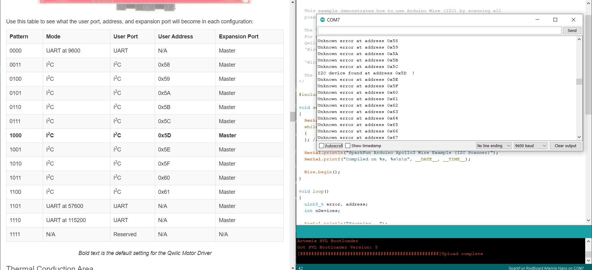
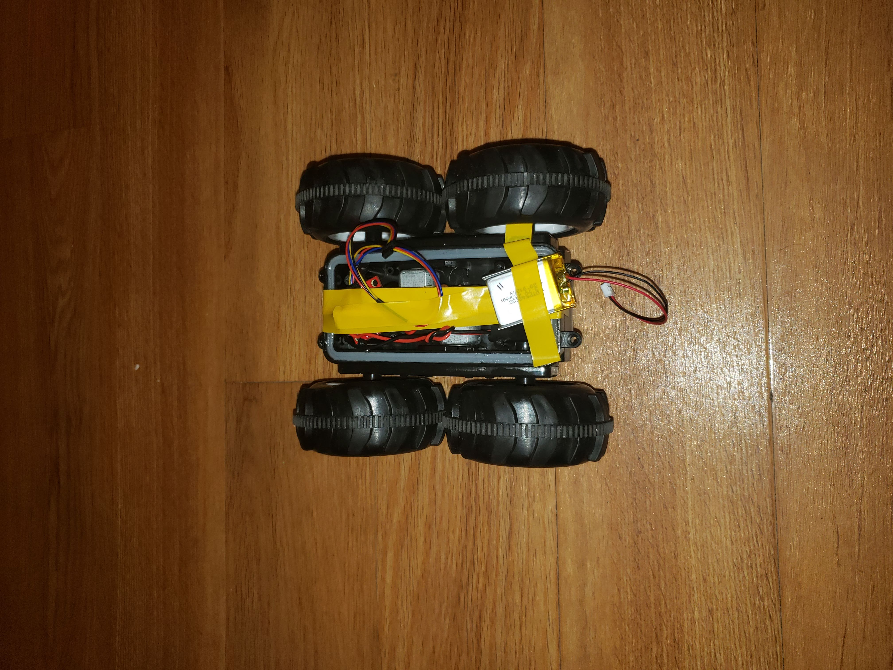

# Lab 4: Open Loop Control
In this lab, I dissesembled the robot and removed the preexisting control PCB. This was then replaced with the Artemis board and Serial Controlled Motor Driver. From there, I was able to implement open loop control on the RC car.
## Serial Controlled Motor Driver (SCMD)
The motor driver was connected to the Artemis board using a Qwiic connector. After downloading the SCMD library through Arduino, I was able to run the `Example1_wire` code. Using this code, I determined the SCMD address to be 0x5D, which matches the datasheet.



## RC Car Modifications
The next step was to dissesemble the RC car in order to add the SCMD and Artemis board. I began by removing the top in order to expose the PCB and motors. After removing the PCB and cutting the motor wires, I spent a considerable amount of time stripping and inserting the wires into the SCMD. My wires were rather short, making it hard to fit the SCMD into the preexisting gap for the old PCB. As such, I had to simply rest it on top and tape it down.



With the SCMD and battery on, the Artemis board could then rest on top of the tape.

## Motor Testing + Straight Line Driving
Next up, I ran the motors through a series of tests to make sure I understood how to control each set of wheels. A wheel is given a direction and speed with the command:
```
myMotorDriver.setDrive( MOTOR, DIRECTION, SPEED);
```
where all inputs are integer values. I found that each motor needed a speed of around 50 for the wheels to actually spin. It also seemed that, given the same speed, the left wheels would spin faster than the right wheels. This can be seen a bit in my motor tests

<iframe width="560" height="315" src="https://www.youtube.com/embed/v_a-TaL4rE0" frameborder="0" allow="accelerometer; autoplay; clipboard-write; encrypted-media; gyroscope; picture-in-picture" allowfullscreen></iframe>

After testing the motors, I got my robot to drive in a straight line. This took some tuning as I had to determine just how much faster the left wheels were than the right. I settled on a left speed of 90 and a right speed of 105 to get a relatively straight path. Here is my main loop to do this:

```
// straight line
void loop()
{
  //***** Operate the Motor Driver *****//
  //  This walks through all 34 motor positions driving them forward and back.
  //  It uses .setDrive( motorNum, direction, level ) to drive the motors.

  Serial.println("Motor Test.");
  digitalWrite( LEDPIN, 1 );
  delay(5000);
  // straight for 5 seconds
  myMotorDriver.setDrive( LEFT, LF, 90); //left slightly faster than right
  myMotorDriver.setDrive( RIGHT, RF, 105); // right forward
  delay(2300);
  // stop for 5 seconds
  myMotorDriver.setDrive( RIGHT, RF, 0); //Drive motor i forward at full speed
  myMotorDriver.setDrive( LEFT, LF, 0); //Drive motor i forward at full speed
  delay(5000);
  digitalWrite( LEDPIN, 0 );

}
```

Here is the end result

<iframe width="560" height="315" src="https://www.youtube.com/embed/RbpFqwHtotY" frameborder="0" allow="accelerometer; autoplay; clipboard-write; encrypted-media; gyroscope; picture-in-picture" allowfullscreen></iframe>

## Open Loop Robot
Finally, I expanded upon my straight line code to provide various open loop controls to the robot. Here I noticed some peculiar behavior. First, I could not get the wheels to spin in opposite directions, something that was trivial with the remote and is very important for turning in place. I was unfortunately unable to debug this issue. Another thing I noticed was that actions would be very different when going forward or in reverse, even for the same wheel speeds. Here is a small sequence of movements using open loop controls and the code used to produce these movements:

<iframe width="560" height="315" src="https://www.youtube.com/embed/Y9dn6dxjUjQ" frameborder="0" allow="accelerometer; autoplay; clipboard-write; encrypted-media; gyroscope; picture-in-picture" allowfullscreen></iframe>

```
void loop()
{
 // Open Loop Control
  digitalWrite( LEDPIN, 1 );
  delay(10000);
  // straight
  myMotorDriver.setDrive( LEFT, LF, 90); 
  myMotorDriver.setDrive( RIGHT, RF, 110); 
  delay(2300);
  // stop for 1 second
  myMotorDriver.setDrive( LEFT, LF, 0); 
  myMotorDriver.setDrive( RIGHT, RF, 0); 
  delay(1000);
  // backwards
  myMotorDriver.setDrive( LEFT, LR, 90); 
  myMotorDriver.setDrive( RIGHT, RR, 100); 
  delay(2300);
  // stop for 1 second
  myMotorDriver.setDrive( LEFT, LR, 0); 
  myMotorDriver.setDrive( RIGHT, RR, 0); 
  delay(1000);
  // Swerve
  myMotorDriver.setDrive( LEFT, LF, 120); 
  myMotorDriver.setDrive( RIGHT, RF, 0); 
  delay(1000);
  myMotorDriver.setDrive( LEFT, LF, 0); 
  myMotorDriver.setDrive( RIGHT, RF, 120); 
  delay(1000);
  // Swerve
  myMotorDriver.setDrive( LEFT, LF, 120); 
  myMotorDriver.setDrive( RIGHT, RF, 0); 
  delay(1000);
  myMotorDriver.setDrive( LEFT, LF, 0); 
  myMotorDriver.setDrive( RIGHT, RF, 120); 
  // Swerve back
  myMotorDriver.setDrive( LEFT, LR, 120); 
  myMotorDriver.setDrive( RIGHT, RR, 0); 
  delay(1000);
  myMotorDriver.setDrive( LEFT, LR, 0); 
  myMotorDriver.setDrive( RIGHT, RR, 120); 
  delay(1000);
  // Swerve back
  myMotorDriver.setDrive( LEFT, LR, 120); 
  myMotorDriver.setDrive( RIGHT, RR, 0); 
  delay(1000);
  myMotorDriver.setDrive( LEFT, LR, 0); 
  myMotorDriver.setDrive( RIGHT, RR, 120); 
  delay(1000);
  // stop for 1 second
  myMotorDriver.setDrive( LEFT, LR, 0); 
  myMotorDriver.setDrive( RIGHT, RR, 0); 
  delay(1000);
}
```

# Simulator Open Loop Control
The next part of the lab was to set up the simulator to use open loop control as well. This was done using Jupyter notebooks.

## Setup
I began by downloading the lab 4 source code and sourcing the setup script. After this, I was able to run `lab4-manager` to run the simulator.

## Jupyter Lab
Using the `jupyter lab` command, I was able to start a Jupyter server and open a notebook in Firefox. I was able to move the simulated robot in a square using the following Python code

```
for x in range(4):
  # go straight for 2 seconds
  robot.set_vel(0.5,0)
  time.sleep(2)
  # turn
  robot.set_vel(0,0.5)
  time.sleep(3.15)
# stop
robot.set_vel(0,0)
```

In this code, the line `robot.set_vel(lin,ang)` sets the robots linear and angular velocities respectively. Here is my robot moving in a square

<iframe width="560" height="315" src="https://www.youtube.com/embed/AZKlVHm2EWc" frameborder="0" allow="accelerometer; autoplay; clipboard-write; encrypted-media; gyroscope; picture-in-picture" allowfullscreen></iframe>
