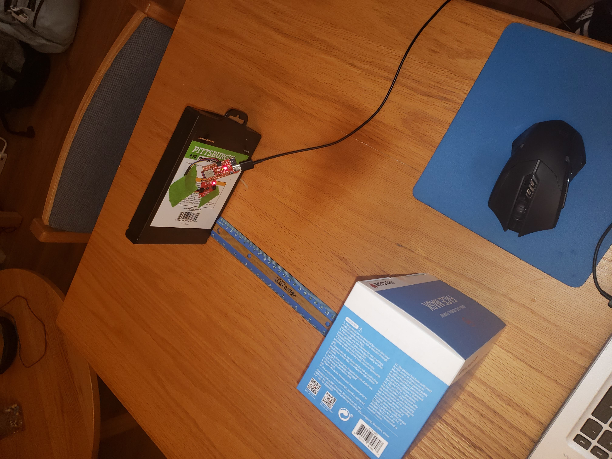
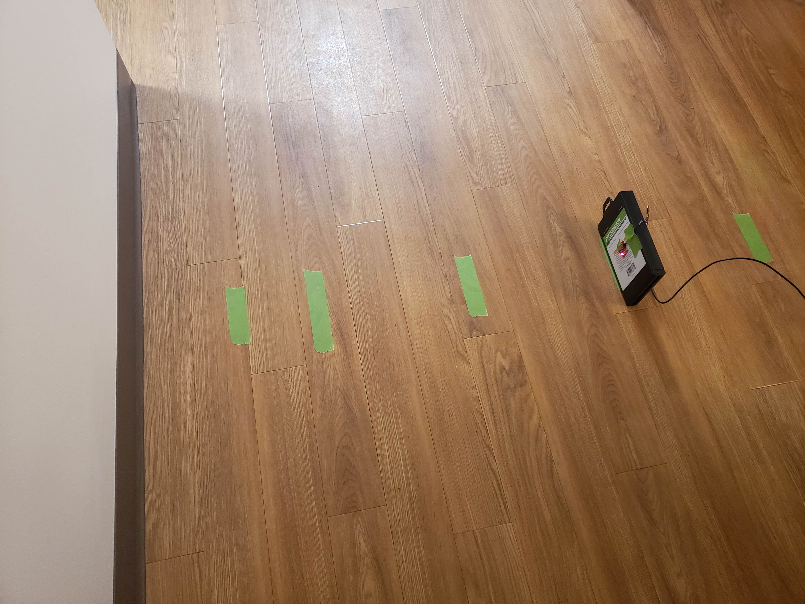
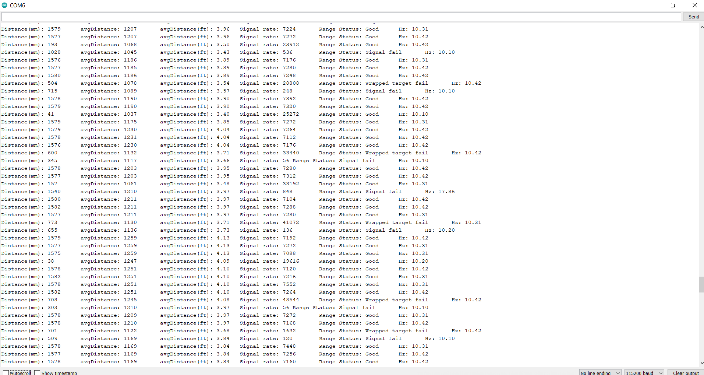
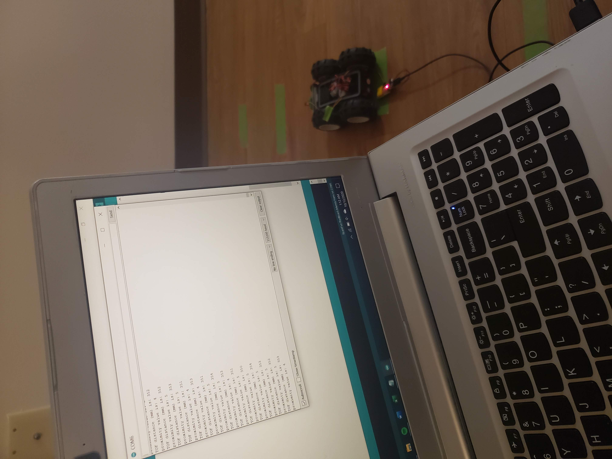

# Lab 5: Obstacle Avoidance
In this lab, the 4m Time of Flight (ToF) and 20cm Proximity Sensor were used to implement obstacle avoidance on the robot. This behavior was then replicated in the simulator using Jupyter notebook.
## Proximity Sensor
The first step was to setup the proximity sensor. Upon running the I2C scan, I found an address of 0x60, which matches the address physical written on the sensor. 
<br/>
Next, the sensor was tested by running the `Example4_AllReadings` code. Using this code, I tested the sensor at varying distances and against different color objects.



When no object was present, the sensor returned a value of 4. The other test results can be seen in the table below. The value in each box represents the returned sensor value.

| color/distance | 5cm | 10cm | 15cm | 20cm | 25cm | 30cm |
|----------------|-----|------|------|------|------|------|
| light blue     | 487 | 104  | 65   | 36   | 21   | 14   |
| yellow         | 521 | 167  | 60   | 31   | 20   | 15   |

The difference in color made a noticeable difference in sensor reading for smaller distances from the sensor, but further away the object, the less impactful color became. 
<br/>
There was a considerable lag between moving an object and seeing changes on the proximity value, almost 4 seconds. This lag would make it very difficult to use the proximity sensor by itself, especially for a robot as fast as ours.
## Time of Flight Sensor
The next step was to setup the time of flight (ToF) sensor. Upon running the I2C scan, I found an address of 0x29, which matches the address from the sensor documentation.
<br/>
Next, the ToF sensor was tested by running the `Example1_ReadDistance` code. My sensor did not require calibration. I tested the sensor by putting tape at set distances from a wall and checking the returned distance from the ToF sensor.



The table below shows the distance of the tape from the wall and the sensor reading. The ToF sensor can accurately detect a wall 3 feet away, which is plenty of time to stop and readjust our course.

| actual (ft) | 0.5ft | 1ft  | 2ft  | 3ft  | 4ft  |
|-------------|-------|------|------|------|------|
| sensor (ft) | 0.48  | 1.00 | 2.02 | 3.01 | 4.10 |

I then tested the accuracy of measurements. By rapidly moving my hand back and forth over the sensor, I got perioidic errors in measurement, as shown below:



This quick of changes is probably faster than anything the robot would reasonably encounter. Even still, the sensor was able to detect some of the passes of my hand. This reassured me that the robot would be able to detect walls reliably, even at higher speeds. 
## Obstacle Avoidance
Finally, it was time to put the sensors on the robot and let it run free. I began by mounting the sensors onto the robot and then placing the robot near the wall and reading out the sensor values. This gave me an idea of what values to set my obstacle thresholds at.



The physical design of my robot leaves much to be desired, but with some tools arriving in the next few days, I aim to improve the phyiscal design for the next lab.
<br/>
With the sensors mounted and thresholds set, I let my robot at the wall. The code I gave it was to reach a wall, start, and turn. This was done with the following loop code:
```
distanceSensor.startRanging();
 while (!distanceSensor.checkForDataReady())
  {
    delay(1);
  }
  int distance = distanceSensor.getDistance(); //Get the result of the measurement from the sensor
  Serial.print("TOF distance (mm) is: ");
  Serial.print(distance);
  Serial.println();
  distanceSensor.clearInterrupt();
  distanceSensor.stopRanging();
  unsigned int proxValue = proximitySensor.getProximity();
  Serial.print("proximity value is: ");
  Serial.print(proxValue);
  Serial.println();
 // if no object, straight
 if (distance > 400 && proxValue < 30 ) {
  myMotorDriver.setDrive( LEFT, LF, 100); 
  myMotorDriver.setDrive( RIGHT, RF, 120);
 }
 // else, avoid
 else {
  // stop
  myMotorDriver.setDrive(LEFT, LR, 80);
  myMotorDriver.setDrive(RIGHT, RR, 100);
  delay(100);
  // turn away
  myMotorDriver.setDrive(LEFT, LF, 100);
  myMotorDriver.setDrive(RIGHT, RR, 120);
  delay(400); 
 }
```
There is also a large disparity between the left and right wheel speeds. This has unfortunately proven neccessary to drive straight, as the two sets of wheels do not spin at the same speed for the same input. These speeds were also my final speeds. I began with lower values (L=70,R=90) and kept increasing the speed over time. The end result can be seen in the video below:

<iframe width="560" height="315" src="https://www.youtube.com/embed/R7o6V2NIrw0" frameborder="0" allow="accelerometer; autoplay; clipboard-write; encrypted-media; gyroscope; picture-in-picture" allowfullscreen></iframe>

Right now, my robot is a bit jittery on turning, and can struggle if it comes into a wall nearly parallel to it. I hope that, with a bit more tuning, I can make the robot's movements a bit more fluid. The issue of approach angle could be tough to tackle. 
## Virtual Obstacle Avoidance
In this section of the lab, Jupyter notebook was used to implement obstacle avoidance code in the robot simulator. 
<br/>
To begin this section, I setup the provided base code. After extracting the code and running the setup script, I opened the simulator. From here, I started the Jupyter lab server and opened the given Jupyter notebook file. 
<br/>
In this notebook, I utilized the `get_laser_data()` and `set_vel()` member functions of the Robot class to control the sim robot. Similar to my physical robot, I set a sensor threshold and, if my sensor reading was below my threshold, my robot would turn away from the wall in front.

```
def perform_obstacle_avoidance(robot):
  while True:
     if (robot.get_laser_data() < 0.75):
	   robot.set_vel(0,0.75)
	   time.sleep(1)
	 else:
	   robot.set_vel(0.5,0)
	   time.sleep(0.1)
```

 I once again ran into the issue of approaching a wall from a steep angle. I also had the problem of the robot catching an end of a wall, as the sensor is a straight line from the middle of the robot and wouldn't stop the edge of the robot from hitting the end of the wall. This case can be seen at the end of my video below:

<iframe width="560" height="315" src="https://www.youtube.com/embed/ZSCjdzmwblw" frameborder="0" allow="accelerometer; autoplay; clipboard-write; encrypted-media; gyroscope; picture-in-picture" allowfullscreen></iframe>