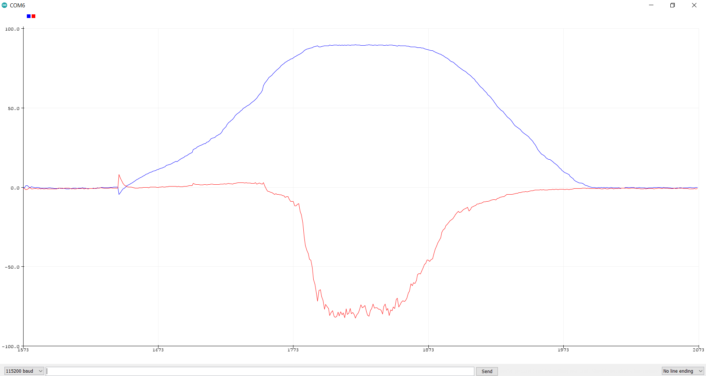
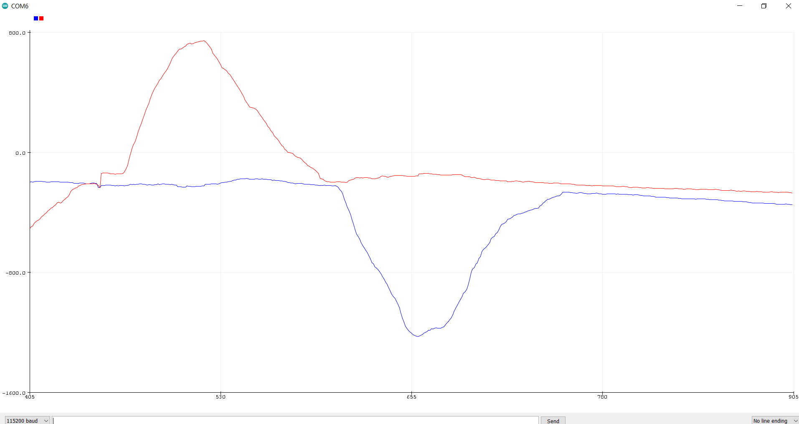

# Lab 6: IMU, PID, and Odometry
The goal of this lab was to set up the IMU for the robot in order to estimate orientation and pose. With the IMU added to the robot, the next step was to attempt PID control using the IMU in order to rotate the robot at a slow, constant speed. This type of movement will be important for scanning an area using the TOF sensor in later labs.
## IMU
I began by connecting the IMU to the Artemis and running the Wire exmaple to scan the I2C channels. The IMU was found at address 0x69, which matches the address from the datasheet. 
<br/>
Next, I ran the `Example1_Basics` code and watched the acceleration and gyroscope data change as I moved the IMU. The gyroscope data would hover around 0.0 whenever the board was still, and would increase in magnitude as the board was flipping and turning. Acceleration showed similar results, except when held straight up, since gravity was pulling downwards.
### Accelerometer
First, I used the equations from class to convert the accelerometer data into pitch and roll. This gave me the following code:
```
float pitch_a = atan2( myICM.accX(), myICM.accZ() ) * 180 / M_PI;
float roll_a = atan2( myICM.accY(), myICM.accZ() )  * 180 / M_PI;
```
I then held the IMU in different poses to test the accuracy of the accelerometer.
<br/>
Flat on a table (pitch = roll = 0), I saw the following outputs:
- Pitch = -000.776 , Roll =  000.388
- Pitch = -000.587 , Roll =  000.196
- Pitch = -000.304 , Roll =  000.055
<br/>
Against wall (pitch = 90):
- Pitch =  090.925 , Roll = -136.790
- Pitch =  089.775 , Roll = -082.763
- Pitch =  090.111 , Roll = -092.726
<br/>
Against wall + inverted (pitch = -90):
- Pitch = -090.388 , Roll =  105.945
- Pitch = -090.224 , Roll =  097.853
- Pitch = -090.415 , Roll =  106.091
<br/>
Against wall + rotated clockwise (roll = 90):
- Pitch = -163.142 , Roll =  090.928
- Pitch =  144.162 , Roll =  091.014
- Pitch =  149.421 , Roll =  091.242
<br/>
Against wall + rotated counter-clockwise (roll = -90):
- Pitch = -131.186 , Roll = -090.193
- Pitch = -128.047 , Roll = -090.503
- Pitch = -126.469 , Roll = -090.474
<br/>
From this data, I found that the roll or pitch that I was measuring would be within a 2-3 degrees of the expected value. The other value, however, fluctuated quite a bit.
<br/>
Next, I looked at noise from the accelerometer. I struggled to get a clear dataset that defined a clear cutoff frequency for me. Because of this, I picked a starting cutoff frequency of 250 Hz. This value seemed plausible based on the data I was able to get. With alpha = (T/T+RC), I found alpha = 0.12. From this value, I toyed around with different delays and frequencies. I settled on alpha = 30 as it seemed to get rid of the most noise without introducing too much lag to measurements. These images show the acceleration roll and pitch before (left) and after (right) the Low Pass Filter:

<p float="left">
  
   
</p>

The filtered image (right) is a lot smoother than the left image. Even still, some noise remains. 
The code added to filter the data is as follows:
```
alpha = .30;
pitch_alpha = (alpha * pitch_a)+((1 - alpha) * old_pitch);
old_pitch_a = pitch_alpha;
roll_alpha = (alpha * roll_a)+((1 - alpha) * old_roll);
old_roll_a = roll_alpha;
```

### Gyroscope
Next, the gyroscope was used to calcuate pitch, roll, and yaw. This was done with the following code:

```
pitch_g = pitch_g - myICM.gyrY() * (float)dt / 1000000 ; 
roll_g = roll_g   + myICM.gyrX() * (float)dt / 1000000 ; 
yaw_g = yaw_g     + myICM.gyrZ() * (float)dt / 1000000 ;
```
Where the divisor term was found to be necessary to return values on the same scale as the accelerometer.
<br/>
While less noisy than the accelerometer, the gyroscope suffered from a noticeable drift. The following image of the gyroscope data shows far less spikes and jumps than the accelerometer, but you can see the data slowly declining, even when the IMU is still.



A complimentary filter was then used, taking both the accelerometer and gyroscope data. This was done with the following code:
```
pitch = ( old_pitch + pitch_g * (float)dt / 1000000) * (1 - alpha) + old_pitch_a * alpha;
roll =  ( old_roll  + roll_g  * (float)dt / 1000000) * (1 - alpha) + old_roll_a  * alpha;
old_pitch = pitch;
old_roll = roll;
```
This filter reduced the drift seen from the gyroscope as well as reduced the noise seen from the accelerometer. While some drift and noise remained, the overall data was improved from using each sensor independently.


### Magnetometer
Finall,y the magnetometer was used to measure yaw. This was done with the following code:
```
xm = myICM.magX() * cos(pitch) - myICM.magY() * sin(roll) * sin(pitch) + myICM.magZ() * cos(roll) * sin(pitch);
ym = myICM.magY() * cos(roll)  + myICM.magZ() * sin(roll);
yaw = atan2(ym, xm);
```
The results of the magnetometer, however, were extremely noisy. I ended up just using the gyroscope for my yaw measurements. The following image shows the yaw data from the gyroscope when rotating the robot around. It was fairly resistant to changes in pitch as well.


## PID Control
Next, PID control was implmented to have the robot spin in place at a slow and constant rate. I began by having the robot spin in circles as the motor speeds increased and then decreased. This gave me a better sense of how slow I could get the robot to spin with simply open loop control.
<br/>
I then used the Arduino PID library to implement PID control for the motors to see how slow I could get them with closed loop control. I began with a setpoint of 100 and Kp = 2 and Ki = Kd = 0. I first tried to get the robot spinning at a constant speed, even if it was fast. From there, I worked my way down slower and slower. The common issue I found was that, as I got slower, the robot would become jerky and would suddenly speed up for a brief moment before slowing back down. As such, I ended up settling for a faster speed that was still constant.
<br/>
My final PID parameters were:
- Setpoint = 50
- Kp = 3
- Ki = 1
- Kd = 0
<br/>
I decided not to use a derivative term because, each time I did, the robot would slow down until it came to a full stop, and then remain there. I was unable to find a successful tuning that included an derivative term.

<iframe width="560" height="315" src="https://www.youtube.com/embed/IT9FuBDG4cQ" frameborder="0" allow="accelerometer; autoplay; clipboard-write; encrypted-media; gyroscope; picture-in-picture" allowfullscreen></iframe>

## Odometry and Ground Truth for Virtual Robot
This section of the lab involved using the robot simulator to compare ground truth data to odometry data. In this case, ground truth data was the exact location of the robot as provided by the simulator. In a real case, ground truth data would most likely be provided by an extra reliable sensor. 
<br/>
In my efforts to complete this section of the lab, I ended up running out of space on my VM. In fact, I could not even open it in order to add more space. 


Following the advice on Campuswire, I reinstalled the VM and added more space to this new VM. This was successful, and I was able to complete this part of the lab.
<br/>
In Jupyter notebook, I implemented the `update_plot()` function as follows:
```
def update_plot(robot):
  while (True):
	odom_pose = robot.get_pose()
	robot.send_to_plot(odom_pose[0], odom_pose[1], ODOM)
	gt_pose = robot.get_gt_pose()
	robot.send_to_plot(gt_pose[0], gt_pose[1], GT)
	time.sleep(0.1)
```
I saw quite a difference between the odometry data and the ground truth. When the robot was still, the plots for the odometry data formed a sort of blob from the noise and slight variation of points. As the robot moved about, the odometry points would sometimes go in the wrong direction. This behavior can be seen in the following video:

<iframe width="560" height="315" src="https://www.youtube.com/embed/_5RDk9t1OsU" frameborder="0" allow="accelerometer; autoplay; clipboard-write; encrypted-media; gyroscope; picture-in-picture" allowfullscreen></iframe>